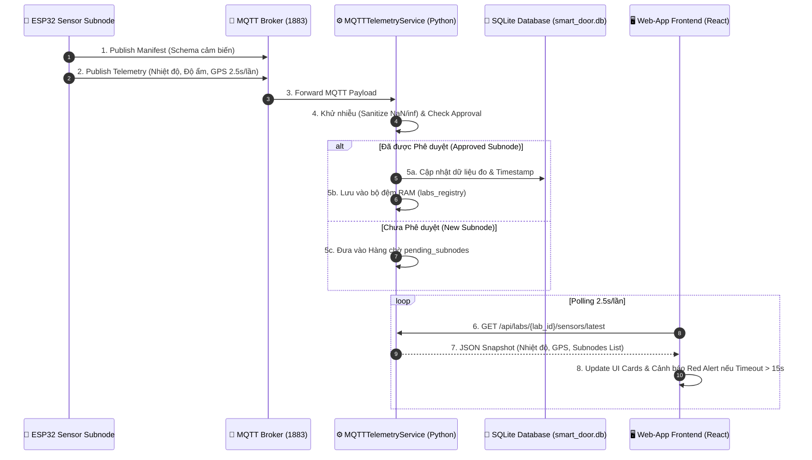
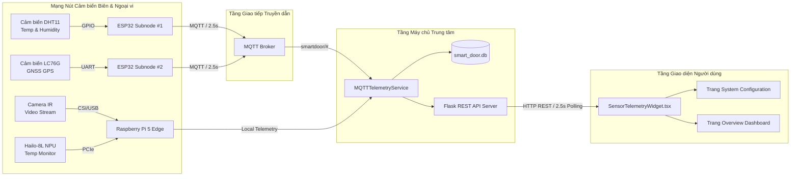

# 📡 BÁO CÁO CHI TIẾT: CƠ CHẾ KẾT NỐI VÀ HOẠT ĐỘNG CỦA HỆ THỐNG CẢM BIẾN TRÊN WEB-APP

Tài liệu này giải thích chi tiết toàn bộ kiến trúc, giao thức kết nối, luồng dữ liệu và cơ chế vận hành của **Hệ thống Cảm biến (Sensor Telemetry System)** từ bo mạch cảm biến phần cứng (ESP32 / Raspberry Pi 5), qua dịch vụ xử lý trung tâm (MQTT Broker & Flask Server), cho đến giao diện người dùng thời gian thực trên **Web-App Admin Dashboard**.

---

## 📖 MỤC LỤC

1. [Tổng quan Kiến trúc Kết nối Tận cùng (End-to-End Architecture)](#1-tổng-quan-kiến-trúc-kết-nối-tận-cùng)
2. [Chi tiết Các Tầng Cảm biến trong Hệ thống](#2-chi-tiết-các-tầng-cảm-biến-trong-hệ-thống)
   - [2.1. Cảm biến Nội tại tại Nút Biên (Raspberry Pi 5 Hardware & IR Camera)](#21-cảm-biến-nội-tại-tại-nút-biên-raspberry-pi-5-hardware--ir-camera)
   - [2.2. Mạng Nút Cảm biến Ngoại vi Không dây (ESP32 Wireless Sensor Subnodes)](#22-mạng-nút-cảm-biến-ngoại-vi-không-dây-esp32-wireless-sensor-subnodes)
   - [2.3. Dịch vụ Xử lý Trung tâm (Central MQTT Service & SQLite Database)](#23-dịch-vụ-xử-lý-trung-tâm-central-mqtt-service--sqlite-database)
   - [2.4. Giao diện Giám sát Real-time trên Web-App (React Telemetry Widget)](#24-giao-diện-giám-sát-real-time-trên-web-app-react-telemetry-widget)
3. [Cơ chế Phê duyệt & Ghép nối Nút Cảm biến (Subnode Pairing & Maintenance Workflow)](#3-cơ-chế-phê-duyệt--ghép-nối-nút-cảm-biến)
4. [Cơ chế Giám sát Mất kết nối & Cảnh báo Sự cố (Watchdog & Fault Tolerance)](#4-cơ-chế-giám-sát-mất-kết-nối--cảnh-báo-sự-cố)
5. [Sơ đồ Luồng Dữ liệu & Tuần tự (Mermaid Sequence & Flow Diagrams)](#5-sơ-đồ-luồng-dữ-liệu--tuần-tự)

---

## 1. TỔNG QUAN KIẾN TRÚC KẾT NỐI TẬN CÙNG

Hệ thống cảm biến được thiết kế theo mô hình **Biên – Trung tâm – Web-App (Edge – Central Server – Web Dashboard)**. Toàn bộ các thông số môi trường vi khí hậu phòng Lab (Nhiệt độ, Độ ẩm, Vị trí GPS, Bụi mịn, Khí gas...) và thông số phần cứng (Nhiệt độ CPU/NPU, Tốc độ khung hình Camera, Trạng thái Khóa cửa) được tự động thu thập và hiển thị liên tục lên giao diện quản trị Web-App.

```
+-----------------------------------------------------------------------------------+
|                                1. TẦNG CẢM BIẾN VẬT LÝ                             |
|  [ESP32 Subnode #1]        [ESP32 Subnode #2]         [Raspberry Pi 5 Sensors]    |
|   - DHT11 Temp & Hum        - LC76G GNSS GPS           - CPU Thermal (/sysfs)     |
|   - SDS011 Fine Dust        - LDR Light Lux            - Hailo-8L NPU Temp        |
|   - MH-Z19 CO2 Gas          - MQ2 Fire/Gas             - IR Camera (GStreamer)    |
+-----------------------------------+-----------------------------------------------+
                                    | Giao thức MQTT (Topics: smartdoor/subnodes/#)
                                    v
+-----------------------------------------------------------------------------------+
|                            2. TẦNG TRUNG TÂM & BACKEND                            |
|  [MQTT Broker (Port 1883)] ──> [MQTTTelemetryService (mqtt_service.py)]          |
|                                  │ - Khử nhiễu NaN/inf                            |
|                                  │ - Watchdog Timeout (15s)                       |
|                                  │ - Pending & Approved Subnodes Registry        |
|                                  v                                                |
|                             [(SQLite DB: smart_door.db)]                          |
|                                  │                                                |
|                             [Flask REST API Server (api_server.py)]               |
|                               - GET /api/labs/{labId}/sensors/latest              |
|                               - GET /api/labs/{labId}/sensors/export              |
+-----------------------------------+-----------------------------------------------+
                                    | HTTP Polling (2.5 giây/lần)
                                    v
+-----------------------------------------------------------------------------------+
|                                3. TẦNG WEB-APP FRONTEND                           |
|  [Web-App Admin Dashboard (React + TypeScript)]                                   |
|   - System Overview Page (/system)                                                |
|   - SensorTelemetryWidget.tsx (Dynamic Sensor Cards & Map Integration)            |
|   - Red Alert Banner (Cảnh báo mất kết nối cảm biến tự động)                      |
+-----------------------------------------------------------------------------------+
```

---

## 2. CHI TIẾT CÁC TẦNG CẢM BIẾN TRONG HỆ THỐNG

### 2.1. Cảm biến Nội tại tại Nút Biên (Raspberry Pi 5 Hardware & IR Camera)
*Tệp mã nguồn: `src/Newest_Version/hardware.py`, `src/Newest_Version/app.py`*

1. **Cảm biến Nhiệt độ Chip CPU (Raspberry Pi 5)**:
   - **Cách thức kết nối**: Đọc trực tiếp định kỳ 2 giây/lần từ Linux thermal sysfs (`/sys/class/thermal/thermal_zone0/temp`).
   - **Công dụng**: Giám sát nhiệt độ hoạt động của bo mạch Pi 5, ngăn ngừa quá nhiệt trong quá trình xử lý hình ảnh AI.
2. **Cảm biến Nhiệt độ Card Tăng tốc AI (Hailo-8L NPU)**:
   - **Cách thức kết nối**: Sử dụng SDK `hailo_platform` (`hailo_device.control.get_chip_temperature()`) với cơ chế tái sử dụng context (context reuse) để giảm tải tài nguyên CPU.
   - **Công dụng**: Đảm bảo chip NPU Hailo-8L chạy mô hình nhận diện khuôn mặt ArcFace luôn nằm trong dải nhiệt an toàn (< 75°C).
3. **Camera Hồng Ngoại (IR Live View Stream & Liveness Sensors)**:
   - **Cách thức kết nối**: Nhận luồng ảnh nhị phân qua OpenCV & GStreamer pipeline.
   - **Công dụng**: Tính toán chỉ số độ sắc nét khuôn mặt (`variance`) và tỷ lệ phản xạ ánh sáng (`ratio`) để chống giả mạo (Anti-spoofing). Đồng thời cung cấp luồng phát video MJPEG trực tiếp lên Web-App ở tốc độ 15-20 FPS mà **không ghi file lên đĩa đệm (Zero Disk Wear)**.

---

### 2.2. Mạng Nút Cảm biến Ngoại vi Không dây (ESP32 Wireless Sensor Subnodes)
*Tệp mã nguồn: `firmware/esp32_sensor_framework.hpp`, `firmware/esp32_subnode_template.ino`*

Các bo mạch ESP32 đóng vai trò là các **Subnode cảm biến không dây phân tán** đặt trong không gian phòng thực hành.

* **Các dòng Cảm biến hỗ trợ tích hợp**:
  - **DHT11 / DHT22**: Đo Nhiệt độ môi trường (°C) và Độ ẩm tương đối (% RH).
  - **LC76G GNSS GPS**: Đo Tọa độ địa lý (Latitude, Longitude), Độ cao (Altitude), Tốc độ di chuyển (Speed), Số lượng vệ tinh (Satellites) và chỉ số sai số vị trí HDOP.
  - **Cảm biến Môi trường Mở rộng**: Bụi mịn PM2.5/PM10 (SDS011), Khí CO2 (MH-Z19), Khí độc/Báo cháy (MQ-2/MQ-135), Cường độ ánh sáng (LDR Lux).

* **Giao thức Truyền dữ liệu MQTT**:
  - Mỗi ESP32 chạy một framework C++ tự động duy trì kết nối Wi-Fi và gửi gói tin JSON lên **MQTT Broker** (cổng 1883) qua 2 Topic:
    1. **Manifest Topic** (`smartdoor/subnodes/<subnode_id>/manifest`): Gửi schema khai báo danh sách cảm biến mang theo ngay khi vừa bật nguồn/kết nối lại.
    2. **Telemetry Topic** (`smartdoor/subnodes/<subnode_id>/telemetry`): Gửi chu kỳ **2.5 giây/lần** chứa dữ liệu đo đạc thực tế kèm cờ sức khỏe thiết bị (`status_ok`).

---

### 2.3. Dịch vụ Xử lý Trung tâm (Central MQTT Service & SQLite Database)
*Tệp mã nguồn: `src/Newest_Version/mqtt_service.py`, `src/Newest_Version/api_server.py`, `src/Newest_Version/database.py`*

Dịch vụ `MQTTTelemetryService` chạy dưới dạng một Daemon Thread ngầm trên máy chủ trung tâm:

1. **Lắng nghe & Khử nhiễu Dữ liệu (Data Sanitization)**:
   - Đăng ký nhận dữ liệu từ tất cả các topic `smartdoor/#` và `smartlab/#`.
   - Tự động lọc và chuyển đổi các giá trị vô hiệu (`nan`, `NaN`, `inf`, `Infinity`) từ cảm biến phần cứng bị lỗi thành chuẩn số `0.0`, tránh làm hỏng định dạng JSON API.
2. **Quản lý Bộ đệm Bộ nhớ RAM (In-Memory Multi-Lab Registry)**:
   - Lưu trữ dữ liệu trạng thái cảm biến mới nhất của từng phòng Lab trong cấu trúc dữ liệu `labs_registry`.
3. **Hệ thống RESTful API cho Web-App (`api_server.py`)**:
   - `GET /api/labs/<lab_id>/sensors/latest`: Trả về toàn bộ dữ liệu cảm biến mới nhất của phòng Lab (bao gồm cả chỉ số tổng hợp phòng và danh sách từng Subnode).
   - `POST /api/labs/<lab_id>/sensors/telemetry`: Endpoint tiếp nhận dữ liệu cảm biến cho các thiết bị đẩy trực tiếp qua HTTP.
   - `GET /api/labs/<lab_id>/sensors/export`: Cho phép người quản trị tải file báo cáo lịch sử đo đạc cảm biến dưới dạng Excel/CSV.

---

### 2.4. Giao diện Giám sát Real-time trên Web-App (React Telemetry Widget)
*Tệp mã nguồn: `web_app/src/components/sensors/SensorTelemetryWidget.tsx`, `web_app/src/pages/SystemPage.tsx`*

Giao diện Web-App được xây dựng bằng **React + TypeScript + TailwindCSS** để hiển thị trực quan các thông số cảm biến:

1. **Cơ chế Cập nhật Tự động (Polling 2.5s)**:
   - Component `SensorTelemetryWidget` thiết lập vòng lặp hằng giờ (`setInterval`) gọi API `/api/labs/<lab_id>/sensors/latest` mỗi **2.5 giây/lần** để làm mới số liệu mà không cần tải lại trang.
2. **Thẻ Hiển thị Chỉ số Môi trường (Environmental Cards)**:
   - **Nhiệt độ & Độ ẩm (DHT11)**: Hiển thị giá trị kèm màu sắc động theo ngưỡng nguy hiểm (Màu xanh: An toàn < 30°C, Màu cam: Cảnh báo 30-35°C, Màu đỏ: Nguy hiểm > 35°C).
   - **Định vị GPS (LC76G)**: Hiển thị Tọa độ địa lý, Tốc độ, Số vệ tinh, đồng thời tạo đường dẫn thông minh mở trực tiếp bản đồ **Google Maps** theo vị trí tọa độ thực tế.
3. **Banner Cảnh báo Mất kết nối (Red Alert Banner)**:
   - Tự động tính toán trạng thái kết nối. Nếu phát hiện bất kỳ Subnode nào mất kết nối hoặc quá thời gian timeout, một Banner cảnh báo màu đỏ nổi bật sẽ tự động xuất hiện ở đầu giao diện để nhắc nhở người quản trị.

---

## 3. CƠ CHẾ PHÊ DUYỆT & GHÉP NỐI NÚT CẢM BIẾN

Để ngăn chặn các bo mạch ESP32 lạ hoặc không rõ nguồn gốc tự ý đẩy dữ liệu rác vào phòng Lab, hệ thống áp dụng **Quy trình Phê duyệt 2 Bước (Subnode Pairing Workflow)**:

```
[ ESP32 Cảm biến mới ] 
       │
       │ Gửi Gói tin Manifest / Telemetry qua MQTT
       v
[ MQTTTelemetryService ] ── Kiểm tra ID trong DB?
       │
       ├──> KHÔNG CÓ TRONG DB ──> Đưa vào Hàng chờ "pending_subnodes" (Tối đa 120s)
       │                                  │
       │                                  v
       │                       [ Hiển thị trên Web-App UI ]
       │                       Hiển thị Badge "New Discovered Subnode"
       │                                  │
       │                       ┌──────────┴──────────┐
       │                       │                     │
       │                  [ APPROVE ]           [ REJECT ]
       │                       │                     │
       │                       v                     v
       └──> CÓ TRONG DB <── Lưu vào SQLite      Xóa khỏi hàng chờ
            (Approved)      Bảng `subnodes`
```

1. **Bước 1: Phát hiện Nút mới (Discovery)**: Khi một bo mạch ESP32 mới kết nối Wi-Fi và phát tin qua MQTT, `MQTTTelemetryService` phát hiện ID của thiết bị chưa có trong SQLite Database. Thiết bị lập tức được đưa vào danh sách **Hàng chờ Phê duyệt (`pending_subnodes`)** (tự động giải phóng nếu không được duyệt sau 120 giây).
2. **Bước 2: Phê duyệt trên Web-App (Approval)**: Trên giao diện Web-App sẽ xuất hiện thẻ thông báo có nút cảm biến mới phát hiện. Admin nhấn nút **"Approve"** (hoặc **"Reject"**). Khi được Approve, API `/api/labs/<lab_id>/subnodes/approve` sẽ ghi thông tin thiết bị vào cơ sở dữ liệu `subnodes` để chấp nhận dữ liệu vĩnh viễn.

---

## 4. CƠ CHẾ GIÁM SÁT MẤT KẾT NỐI & CẢNH BÁO SỰ CỐ

Để đảm bảo tính tin cậy 24/7 của hệ thống IoT, chương trình duy trì một **Mạch giám sát ngầm (Watchdog Loop)** chạy liên tục với chu kỳ 2 giây:

* **Ngưỡng Timeout Mất kết nối (15 giây)**:
  - Mỗi khi nhận được tin nhắn từ ESP32, hệ thống cập nhật nhãn thời gian `last_updated_ts`.
  - Nếu khoảng thời gian `current_time - last_updated_ts > 15.0 giây` (do ESP32 mất Wi-Fi, tuột nguồn hoặc hỏng cảm biến), Watchdog Loop sẽ ngay lập tức:
    1. Đổi trạng thái nút sang `online = False`.
    2. Ghi nhận thông điệp lỗi: `"Telemetry timeout (> 15 seconds)"`.
    3. Cập nhật cờ tổng thể của phòng Lab `latest_sensor_data["online"] = False`.
* **Chế độ Bảo trì (Maintenance Mode)**:
  - Người quản trị có thể chủ động bật/tắt cờ `Maintenance Mode` cho từng nút cảm biến trên Web-App. Khi bật chế độ này, nút cảm biến sẽ ngưng phát cảnh báo lỗi timeout và hiển thị trạng thái `"Disconnected for Maintenance"`.

---

## 5. SƠ ĐỒ LUỒNG DỮ LIỆU & TUẦN TỰ

### 5.1. Sơ đồ Luồng Tuần tự (Sequence Diagram)
Sơ đồ mô tả chi tiết hành trình dữ liệu từ Cảm biến phần cứng ESP32 đến Màn hình trình duyệt Web-App:



### 5.2. Sơ đồ Cấu trúc Cảm biến tích hợp (Component Architecture Diagram)



---

## 🎯 TỔNG KẾT
Hệ thống cảm biến trong dự án không chỉ thu thập các chỉ số môi trường đơn thuần mà là một **kiến trúc IoT hoàn chỉnh**, đảm bảo tính an toàn cao nhờ **quy trình phê duyệt nút**, khả năng chịu lỗi nhờ **mạch giám sát Watchdog Timeout 15s**, và trải nghiệm người dùng hiện đại thông qua **giao diện Web-App cập nhật thời gian thực**.
